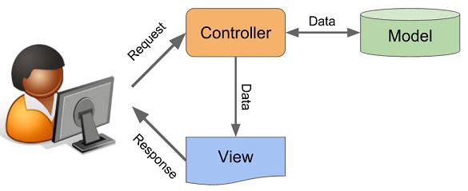

# MVC PHP   
Instrutor, Celker 

 .gitignore
│   .htaccess
│   composer.json
│   index.php
│   LICENSE
│   mvc-php01.png
│   mvc-php02.png
│   readme.md
│
├───core
│       ConfigController.php
│       ConfigView.php
│
├───source
│   ├───app
│   ├───Controllers
│   │       Blog.php
│   │       Contato.php
│   │       Home.php
│   │
│   ├───Models
│   │       ClassConnection.php
│   │       StsListarBlog.php
│   │
│   └───views
│       └───blog
│               listarCars.php
│
└───vendor
    │   autoload.php
    │
    └───composer
            autoload_classmap.php
            autoload_namespaces.php
            autoload_psr4.php
            autoload_real.php
            autoload_static.php
            ClassLoader.php
            installed.json
            installed.php
            InstalledVersions.php
            LICENSE
